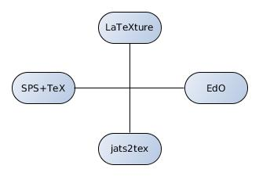
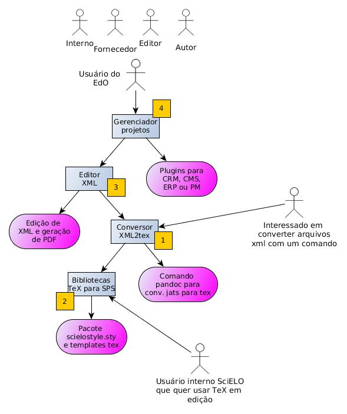

O EdO é uma ferramenta de edição online. Ele necessita e agrupa em um único workflow  três outros projetos que permitem a edição de xmls, conversões de arquivos em tex e e epub e a compilação de PDFs.

O EdO consiste portanto na integração dessas ferramentas 
de edição com softwares de gerenciamento de documentos 
e informação do tipo CRM, CMS, Project Managment ou ERP, 
servindo para os diferente fluxos
de edição e modelos de negócio. 

| Etapas          | Descrição                                                                                                        |
|-----------------|------------------------------------------------------------------------------------------------------------------|
| Planejamento    | O objetivo é descrever os vários workflows e escolher uma única ferramenta como frontend do EdO                  |
| Desenvolvimento | Desenvolvimento de um módulo ou plugin para a integração dos múltiplos serviços (microservices) ligados ao EdO   |
| Beta            | Desenvolvimento de ensaios e uso interno restrito para validação da berramenta                                   |
| Testes          | Testes com equipe interna do SciELO em um fluxo específico de produção                                           |
| Implantação     | Testes com um fluxo maior de serviços de atendimento envolvendo um fornecedor                                    |
